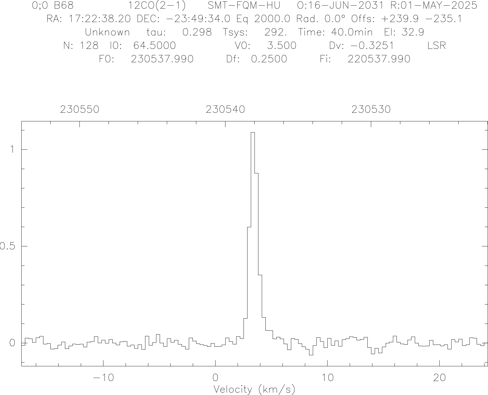
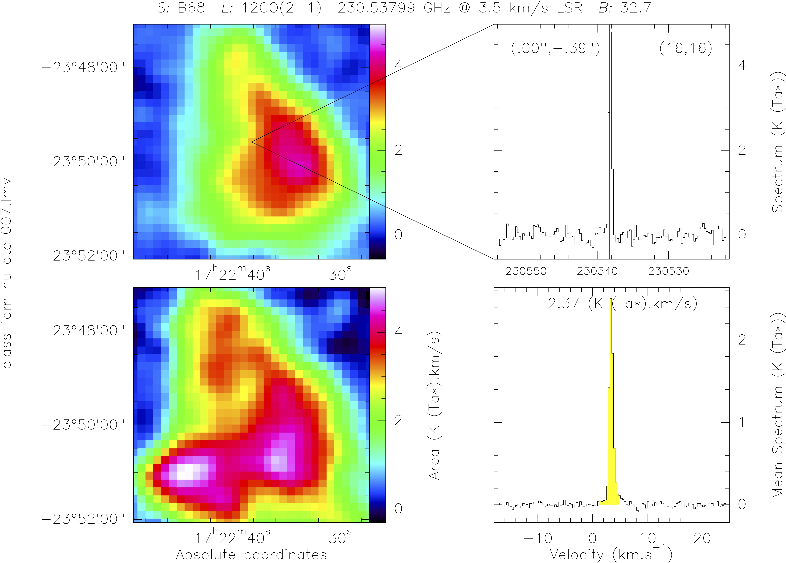

# SMT Mapping Pipeline

Here we describe the steps and flow of the 'SMT Mapping Pipeline', complied by myself (Samantha Scibelli). Some of these scripts I created, but many were 'passed down' from CLASS routines already in available on the [Arizona Radio Observatory (ARO)](https://aro.as.arizona.edu) computers. And, while this pipeline has been created specifically for the ARO's SMT 10m radio telescope, it can also work with ARO 12m data or any On-The-Fly (OTF) single-dish mapping data recorded in a similar format. This is a pipeline/workflow that can convert OTF mapping data to a [GILDAS/CLASS](https://www.iram.fr/IRAMFR/GILDAS/) format, inspect the data, baseline the data, scale the data to the correct main beam temperature, convolve the OTF map to regular grid, combine data from multiple maps, and finally fit the data and create the map in both standard .lmv (to open in CLASS/GREG) and .fits file formats.

This pipeline uses some Python, but mostly [GILDAS/CLASS](https://www.iram.fr/IRAMFR/GILDAS/) scripts. It also assumes you have all the necessary scripts in the directory you are reducing the data in (also located in this repository): 

- 01_script_otf_to_class.py

- 05_baseline.class

- 06_scaleall.class

- 07_convolve.class

- 08_combine.class

- 09_sumall.class

- 10_map_fitting.pro 

- bigbeam.class

You can follow along with example data, are also in this repository, starting from step 4) below. We have 12CO (in 'hu', horizontal polarization in upper side band) and 13CO (in 'hl', horizontal polarization in lower side band) data of the B68 dark cloud. When you unzip the 'class.sdd_FILES.zip' file, you should find the following data files: 

- class.sdd_fqm-hu.atc_007
- class.sdd_fqm-hl.atc_007

In this tutorial we will be following along with the 12CO ('hu') data file. Note that typically you will have both polarizations (i.e., 'hu' and 'vu') that will need to be scaled seperately and combined later. For the purposes of this example, we just work with the horizontal polarization.

## 1) Logging Into Arizona Computer:

Typically, you will want to perform this reduction on the Arizona computer that has your 'raw' data file (with extension .smt or .12m) where you collected your observations, and that already has GILDAS/CLASS installed. If you already have a CLASS formatted data file (i.e., our example file 'class.sdd_fqm-hu.atc_007') and the proper software installed on your own computer, you can skip ahead to step 4) below. 

First, log into the Arizona machines, e.g., 

          ssh -Y obs@smtoast.as.arizona.edu	

Next, enter password (given to you by Arizona staff) and type in observer initials (i.e., directory where observations are located). 
  
Now you are in the directory to run the mapping pipeline! Make sure all the reduction scripts are in this directory. 

*NOTE: you also need to make sure your computer's IP address can log into the arizona computer!*

## 2) Collect Map Scan Numbers:

Either while observing or after observing, make sure to record the beginning and ending scan numbers for each map in the raw data files (e.g., the .smt files). 

Each map should have the same number of scans (a 5 arcminute x 5 arcminute map has 45 scans). 

*NOTE: typically while observing I suggest making a new data for each map in order to avoid confusion and potentially over-writing data.*

## 3) Run Python Script to convert OTF to CLASS

Run in the terminal python script provided, 

        python 01_script_otf_to_class.py 

The script will ask you the following, 

1) What the observer initials are (this can instead be hard-wired for ease)
2) Data file number the mapping data comes from (e.g., if data file is 'class_001.smt' then '1' is your data file number)
3) Beginning scan number
4) End scan number
5) The backend name (e.g., in the example we use 'fqm' for the 250kHz backend)
6) Telescope sideband (upper 'u' or lower 'l')

The script will then produce the CLASS map files that start with ‘class.sdd’ in the name for both vertical and horizontal polarizations.

*NOTE: If you have individual maps in the same data file you can either ‘append’ to the same ‘class.sdd’ file or re-name files to indicate a new map has been produced by the same data file (I recommend the latter).*

## 4) Inspect the data in CLASS 

The spectra can be averaged together and inspected in the CLASS program at this point:

In the terminal type, 

>> CLASS 

Now, within CLASS, 

>> LAS> file in class.sdd_fqm-hu.atc_007	! reads the datafile

>> LAS> dev i w			                ! opens the graphics window

>> LAS> set unit v		       ! plot on velocity scale

>> LAS> find			     ! populates the list with observations

>> LAS> set nomatch		! ignores the offset in position when averaging

>> LAS> av /r				! averages the list population

>> LAS> plot				! plot the spectrum

This inspection will let you know if you have any bad maps/scans and also help you set your window around the spectral line of interest for the baselining (see next step). 

## 5) Baseline the Data

Before you run the 05_baseline.class script,

1) You will need to keep track of the input and output file names either in a spreadsheet or text file!
2) In the script, a window around the line of interest is hard-wired. Adjust this as needed. E.g., in the example script
   
          SET WIN 0 10 !the velocity range around the line of interest

After these initial steps, run the script within CLASS, 

>> LAS > @05_baseline.class

The script will ask you:

1) What data file you want to baseline, e.g.,
   
           class.sdd_fqm-hu.atc_007

2) What you want the name of your output file to be, e.g.,

            class_fqm_hu_atc_007
   
	The script will automatically give the extension as ‘.base’

3) What baseline order is needed (typically '1')

4) Whether you are writing a new file or not (yes)

*Note: the current script doesn’t smooth the data, but it is possible to change this within the script.* 

## 6) Scale the Data 

Similar to the above flow, next, run the 06_scaleall.class file on the .base files you just created. Again, keep track of the files you create!

Run the script within CLASS, 

>> LAS > @06_scaleall.class

The script will ask you: 

1) What data file you want to baseline, e.g.,

              class_fqm_hu_atc_007.base
   
3) What you want the name of your output file to be, e.g.,
   
	   class_fqm_hu_atc_007
   
	The script will automatically give the extension as ‘.scale

4) What factor to multiply your data (e.g., use '1' in this example). This factor is based on the main beam temperature efficiencies (e.g., if your efficiency is 70% you multiple by 1.43). ARO compiles these efficiencies into spreadsheets, which you can find here: https://aro.as.arizona.edu/?q=beam-efficiencies

5) Whether you are writing a new file or not (yes)

## 7) Convolve the Data 

Before diving in to the convolving, you’ll need to know in arcseconds the size of the data cube, the current beam size, the new beam size, and pixel spacing! See [Mangum et al., 2007](https://ui.adsabs.harvard.edu/abs/2007A%26A...474..679M/abstract) for more on best practices for OTF mapping and convolution. 

Then, similar to the above flow, run the 07_convolve.class file on the new .scale files you just created. Again, keep track of the files you create! 

Run the script within CLASS, 

>> LAS > @07_convolve.class

The script will ask you: 

1) To type the following if it is your first time running the script, 

           DEFINE REAL LC BC BB BBS /global

	Then, type 'c' to continue.  

2) What data file you want to convolve, e.g.,

           class_fqm_hu_atc_007.scale

3) What you want the name of your output file to be, e.g.,

           class_fqm_hu_atc_007 

   	The script will automatically give the extension as ‘.conv

4) Information about the convolving. If your map is 5x5 arcmin (as in the example), then from the center your minimum values are -150 arcseconds and maximum values are 150 arcseconds. The step size should be roughly 1/3 of the beam size or smaller. As the script reminds you, the old beam must be smaller than the new beam!
   
      a) The minimum RA offset (in units of arcseconds), e.g.,

           -150  
   
      b) The maximum RA offset (in units of arcseconds), e.g., 
   
           150  
   
      c) The minimum DEC offset (in units of arcseconds)

           -150     
   
      d) The maximum DEC offset (in units of arcseconds)

            150    
   
      e) Enter the Step Size (in units of arcseconds)

            10    
   
      f) Enter the FWHM of New Beam (in units of arcseconds)

            41 
   
      g) Enter the FWHM of Old Beam (in units of arcseconds)
   
            31   

5) Whether you are writing a new file or not (yes)

This script should take the longest to run (several minutes depending on the step size)

*NOTE: You can also edit the script to hard-wire the convolving information if/when you have many maps to run through with the same mapping info from point 3) above!*

## 8) Combine the Data

If you have multiple maps, which is usually the case, you will need to combine the data. To do this, you will first need to copy over the first file into a file you would like to combine all the scans into, e.g., 

            cp class_fqm_hu_atc_007.conv class_fqm_atc_007.comb

Then, keep track of the amount of observation numbers for each map, as you will need to give a new starting number each time you add a map to this combined file. E.g., in 'class_fqm_hu_atc_007.conv' there are a total of XX observations. In this example you don't need to combine any data and can skip ahead to step 10. 

To combine, run the 08_combine.class file in CLASS: 

>> LAS > @08_combine.class

The script will ask you: 

1) What the name is of data file you want to add to the combined file

2) What the name is of your output combined file is that you just created (e.g., class_fqm_atc_007.comb)

3) What new scan number starts this new set of map scans 

## 9) Sum the Data

Typically to save on data space, each position in the map can be ‘summed’ together. Unfortunately it is currently not available with the updated version of CLASS on the arizona computers. This shouldn’t affect the resulting maps!
 
## 10) Fit the Data and Make the Map! 

Before you run the 10_map_fitting.pro script, you need to manually edit the script to include fitting parameters for the line of interest. Adjust this as needed. E.g., in the example script
   
          SET WIN 0 10 !the velocity range around the line of interest

   and, 
   
	  lines 1 "0 1 0 4 0 1" /nocursor !estimate the peak (1K here), the vlsr (4 km/s here), and the width of the line (1 km/s here)

   
Run the 10_map_fitting.pro class file in CLASS: 

>> LAS > @10_map_fitting.pro 

The script will ask you: 

1) What data file you want to fit, e.g.,
   
           class_fqm_hu_atc_007.conv 
   
2) What you want the name of your output fitting file to be, e.g.,
   
	   class_fqm_hu_atc_007

3) What you want the name of the mapping files to be (NEEDS TO BE SAME AS ABOVE), e.g.,
   
	   class_fqm_hu_atc_007
   
The script will create the following map file that can be read by class, 
- class_fqm_hu_atc_007.lmv

To inspect this map you can do the following in CLASS/GREG: 

>> LAS > let name class_fqm_hu_atc_007

>> LAS > let type lmv

>> LAS > go bit     ! channel maps

>> LAS > go view    ! interactive map

>> LAS > hard  class_fqm_hu_atc_007.eps   ! save image

FINALLY, to save as a .fits file, 
   
>> LAS > fits class_fqm_hu_atc_007.fits from class_fqm_hu_atc_007.lmv

